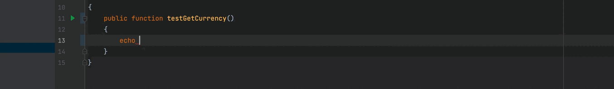

# Currency: A Currency listing library for PHP
[](https://circleci.com/gh/krepysh-spec/currency)
[](https://packagist.org/packages/krepysh-spec/currency) 
[](https://packagist.org/packages/krepysh-spec/currency)
[](https://packagist.org/packages/krepysh-spec/currency)
[](https://packagist.org/packages/krepysh-spec/currency)
[](https://packagist.org/packages/krepysh-spec/currency)

Get country code, symbol, and country name in your code the Currency library.



### Features
- List of all world currencies;
- Get country currency details with country code - ***countryName***, ***name***, ***symbol***;

### Installation

Requirements:
- Composer

1. Install Currency with Composer
```bash
composer require krepysh-spec/currency
```

### Usage

- Get currency code from constants:

```php
echo KrepyshSpec\World\Currency::ANG; // >> 'ANG'
echo KrepyshSpec\World\Currency::USD; // >> 'USD'
echo KrepyshSpec\World\Currency::EUR; // >> 'EUR'
```

- Get all country currency details:

```php
<?php
use KrepyshSpec\World\Currency;
$allCurrencies = Currency::all();
var_dump($allCurrencies);

/**
 ["AFN"]=>
  array(3) {
    ["countryName"]=>
    string(11) "Afghanistan"
    ["name"]=>
    string(19) "Afghanistan Afghani"
    ["symbol"]=>
    string(7) "&#1547;"
  }
  ["ARS"]=>
  array(3) {
    ["countryName"]=>
    string(9) "Argentina"
    ["name"]=>
    string(14) "Argentine Peso"
    ["symbol"]=>
    string(5) "&#36;"
  }
  ["AWG"]=>
  array(3) {
    ["countryName"]=>
    string(5) "Aruba"
    ["name"]=>
    string(13) "Aruban florin"
    ["symbol"]=>
    string(6) "&#402;"
  }
 ...
 */
```

- Get country currency details

```php
<?php
use KrepyshSpec\World\Currency;
$currencyDetails = (new Currency())->'afn';
var_dump($currencyDetails);

/**
 ["AFN"]=>
  array(3) {
    ["countryName"]=>
    string(11) "Afghanistan"
    ["name"]=>
    string(19) "Afghanistan Afghani"
    ["symbol"]=>
    string(7) "&#1547;"
  }
 ...
 */
```

- Get country currency symbol

```php
<?php
use KrepyshSpec\World\Currency;
$currencySymbol = (new Currency())->'afn'['symbol'];
var_dump($currencySymbol);

/**
 "&#1547;"
 ...
 */
```

### Note

- If you're using Currency in a PHP application view(e.g Laravel blade), make sure to escape the symbol for proper rendering.

### Support

For support, email evgeniymykhalichenko@gmail.com or telegram @krep1sh

### License

MIT